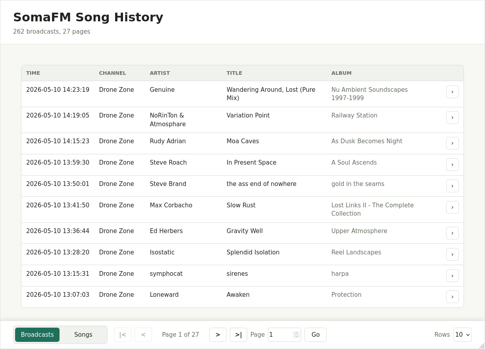

# `somafm-song-history`

# About

`somafm-song-history` is an archive of [SomaFM][soma]'s recently played songs.

This project is developed for my personal use, but I'll be glad to help if you encounter any
[issue][issues].

This project uses [somafm-recentlib][lib] through [JitPack][jitpack].

Please support SomaFM's awesome work [here][soma-support].

# Usage

This program is primarily meant to be self-hosted as a container. I personally use Podman and
Quadlet for this. Below, you will find Podman commands you can run to get started; they should work
with Docker as well.

The images are hosted on [DockerHub][dockerhub]:

- `latest` is the latest stable version (`master` branch).
- `vX.Y.Z` are immutable snapshots of a given version.
- `develop` is the latest development version (`develop` branch).

`somafm-song-history` can be used in 3 different modes. API mode is the main mode; the other two
modes below are historical. I keep them... because I can! :)

## API mode

This mode runs a Javalin server that exposes a REST API. The application runs continuously and
update its database regularly for a given set of channels, according to the config.

Starting from v0.7.0, it also serves a simple UI to browse saved broadcasts and songs:

<p align="center">
  
</p>

To run the application in `api` mode, you will need a PostgreSQL database. You can start one on
port 5432 with the provided Compose file (PostgreSQL 18):

``` shell
podman-compose up -d
```

It will create a `somafm-song-history-db` PostgreSQL container that matches the parameters provided
in [the default config][config]. The application will setup the database on startup using Flyway.
Then start a container using the published image:

``` shell
podman run -d --name somafm-song-history-api --network=host docker.io/alecigne/somafm-song-history:latest "api"
```

Open the web UI:

- `http://localhost:7070/`

The JSON endpoints are also available:

- `http://localhost:7070/broadcasts` to get a paginated list of broadcasts from the DB.
- `http://localhost:7070/songs` to get a paginated list of songs from the DB.
- `http://localhost:7070/broadcasts/recent?channel=dronezone` for recent broadcasts from Drone Zone.

In these manual tests, note that `--network=host` is required to access the database.

## Display mode

This mode prints recently played songs in the console for a given channel.

To run the application in `display mode` with [the default config][config]:

``` shell
podman run --rm -it docker.io/alecigne/somafm-song-history:latest "display" "Drone Zone"
```

## Save mode

This mode saves recently played songs to a database for a given channel, then exits. You will need
the same database as in `api` mode. Once it is up, run:

``` shell
podman run --rm -it --network=host docker.io/alecigne/somafm-song-history:latest "save" "Drone Zone"
```

## Using a custom config

If you need your own config, you can prepare a file in [HOCON][hocon] format. Check the
[default config][config] for reference.

Then pass the config to Podman with your chosen mode:

``` shell
podman run -d --network=host -v /path/to/application.conf:/application.conf docker.io/alecigne/somafm-song-history:latest "api"
```

## Logging

Local runs use human-readable text logs by default. Container images set `LOG_FORMAT=json` so logs
are structured for collectors such as Grafana Loki.

You can override the format explicitly:

``` shell
LOG_FORMAT=json java -jar somafm-song-history.jar "api"
LOG_FORMAT=text java -jar somafm-song-history.jar "api"
```

JSON logs include `service=somafm-song-history` and `environment`, which defaults to `local` and
can be set with `APP_ENV`.

## Cleaning up after your tests

To stop and remove the API container:

``` shell
podman stop somafm-song-history-api
podman rm somafm-song-history-api
```

To stop and remove the PostgreSQL container from Compose:

``` shell
podman-compose down
```

To also remove the PostgreSQL data volume:

``` shell
podman-compose down -v
```

## Using a JAR file (Java 21)

Grab a Jar from the [releases][releases] section or build it from source if you know what you're
doing. Use the commands above if you need a Postgres instance. Then:

``` shell
java -jar somafm-song-history.jar "save" "Drone Zone"
```

or

``` shell
java -jar -Dconfig.file=/path/to/application.conf somafm-song-history.jar "save" "Drone Zone"
```


[soma]:
https://somafm.com

[soma-support]:
https://somafm.com/support/

[issues]:
https://github.com/alecigne/somafm-song-history/issues

[lib]:
https://github.com/alecigne/somafm-recentlib

[soma-channels]:
https://somafm.com/#alpha

[hocon]:
https://github.com/lightbend/config/blob/main/HOCON.md

[dockerhub]:
https://hub.docker.com/r/alecigne/somafm-song-history

[releases]:
https://github.com/alecigne/somafm-song-history/releases

[postgres-note]:
https://lecigne.net/notes/postgres-docker.html

[config]:
https://github.com/alecigne/somafm-song-history/blob/master/src/main/resources/application.conf

[jitpack]:
https://jitpack.io/
